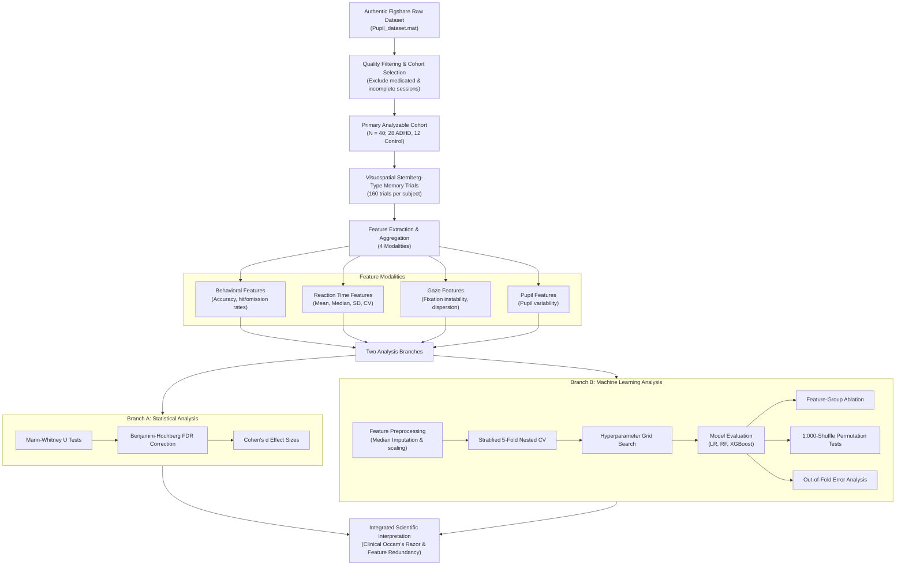

# Conference Architecture Specification

This document defines the methodology flow diagram using Mermaid syntax for incorporation into the Methods section of the paper.

---

## 1. Flow Diagram (Mermaid)

---

## 2. Layout Specifications
*   **Diagram Placement**: Methods Section (under *Experimental Pipeline*).
*   **Caption**: *Figure 1: Complete experimental methodology and pipeline flow, outlining raw database extraction, cohort selection filtering, multi-modal feature grouping, statistical testing, and nested cross-validation machine learning pipelines.*